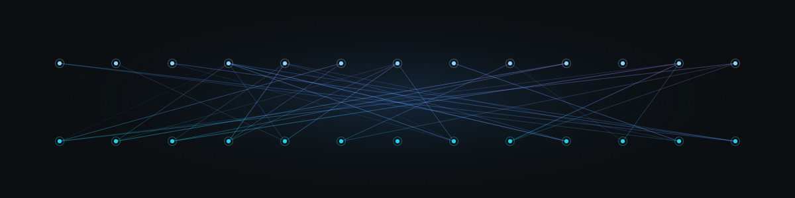

### Akshay Bhardwaj

**I build the scaffolding that makes AI agents reliable enough to actually ship — and I lead the org that ships it.**

Director of Data Science & AI at Mechademy. I walked in as the company's first data scientist; today I run a ~70-person org with a ~20-person DS/AI/ML core at the center of it.

How I got here, short version: petroleum engineer → watched AlphaGo play Move 37 → took it personally → taught myself into AI and never looked back. Ten years on I'm still chasing the same thing — go deep first, orchestrate second. *Depth earns the right to orchestrate.*

Most of what I build now is **agent harnessing**: the orchestration, evals, and guardrails that turn a clever token-predictor into something you can put in front of real users. The model was never the point. Deployment was.

**Stuff I've built because I couldn't not**
- **Ouroboros** — point it at an idea, get back a tested, merge-ready PR. Built around the failure modes that quietly wreck agent teams.
- **Transformer, from scratch** — *Attention Is All You Need* in raw PyTorch. Built to be derived, not imported.
- **faceless-ai** — folklore in, finished horror short out. Five model modalities, one human gate.
- **Raphael** — a voice assistant for my second brain that never leaves my laptop. Fully local, sealed loop.

**Toolbelt** — Python · LangGraph · Ray · PyTorch · Dagster · MLflow · Claude / Gemini / GPT · Whisper.cpp · Ollama · FastAPI · TimescaleDB · Iceberg · AWS

**I write, too** — long-form, first-principles, occasionally funny. An 8-part series on Ray, and the one where I argue [attention is a potluck](https://blog.akshayworks.com).

**[Portfolio](https://portfolio.akshayworks.com)** · **[Blog](https://blog.akshayworks.com)** · **[LinkedIn](https://linkedin.com/in/akshayb7)**
